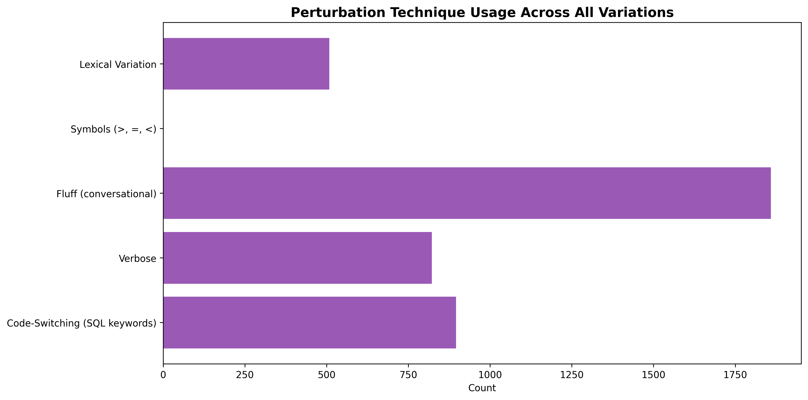

## Progress Report:
This iteration focused on enhancing the Natural Language renderer to generate **multiple variations** of NL prompts from SQL queries. Previously, each SQL query had only one deterministic NL description. Now, each query generates **1 vanilla prompt + 3 perturbed variations** (4 total), creating a dataset of 4,000 NL descriptions from 1,000 SQL queries.

---

## Key Changes

### 1. Enhanced `nl_renderer.py`

**Added 6 Perturbation Techniques:**


#### 1. Lexical Variation (Synonym Substitution)

**Purpose**: Replace fixed template words with randomly selected synonyms to create natural variety.

**Implementation**:
- Added `self.synonyms` dictionary in `__init__()` with 16 keyword mappings:
  ```python
  'get': ['Get', 'Retrieve', 'Fetch', 'Select', 'Show', 'Find', 'Pull']
  'where': ['where', 'filtering by', 'with condition', 'such that', 'that match']
  'from': ['from', 'in', 'within', 'from table']
  'grouped by': ['grouped by', 'group by', 'organized by', 'categorized by', 'partitioned by']
  'ordered by': ['ordered by', 'sorted by', 'arranged by', 'organized by']
  'limited to': ['limited to', 'with limit of', 'taking only', 'restricted to', 'top']
  'having': ['having', 'with condition', 'where aggregate', 'filtered by']
  'joined with': ['joined with', 'join', 'combined with', 'merged with']
  # Plus comparison operators (equals, not equals, greater than, etc.)
  ```
- Created `_choose_word(canonical_form)` helper method
- Integrated into **all clause renderers**:
  - `_render_select_clause()`: "get" keyword
  - `_render_from_clause()`: "from" keyword  
  - `_render_where_clause()`: "where" keyword
  - `_render_group_by_clause()`: "grouped by" phrase
  - `_render_having_clause()`: "having" keyword
  - `_render_order_by_clause()`: "ordered by" phrase
  - `_render_limit_clause()`: "limited to" phrase
  - `_render_expression()`: comparison operator phrases

**Code Changes**:
- 7 clause rendering methods updated to call `_choose_word()` instead of hardcoded strings
- Controlled by `use_variations` parameter (False for vanilla)

---

#### 2. Verbosity Levels

**Purpose**: Generate terse, normal, or verbose versions to mimic different communication styles.

**Implementation**:
- Added `self.verbosity` parameter to constructor: `'terse'`, `'normal'`, or `'verbose'`
- **Terse mode** (concise):
  - Minimal language: "Get user_id where age > 18"
  - No extra words or explanations
- **Normal mode** (default):
  - Standard templates: "Get user_id from users where age greater than 18"
- **Verbose mode** (detailed):
  - Expanded language: "I need to retrieve the following column: user_id from the table named users specifically filtering for records where the condition is: age greater than 18"

**Code Changes**:
- Updated `_render_select_clause()`:
  - Terse: Single line, comma-separated columns
  - Verbose: "I need to retrieve the following column(s): ..."
- Updated `_render_from_clause()`:
  - Verbose: "from the table named {table_name}"
  - Normal/Terse: "from {table_name}"
- Updated `_render_where_clause()`:
  - Terse: "where {condition}"
  - Verbose: "specifically filtering for records where the condition is: {condition}"
  - Normal: "where {condition}"

**Integration**: Applied in SELECT, FROM, WHERE clause renderers

---

#### 3. Operator Format Variation

**Purpose**: Mix symbolic (>, =, <=) and word-based ("greater than", "equals") operator representations.

**Implementation**:
- Added `self.operator_style` parameter: `'words'`, `'symbols'`, or `'mixed'`
- Created `_format_operator(op_type)` method with two operator maps:
  ```python
  'words': {'eq': 'equals', 'gt': 'greater than', 'lte': 'less than or equal to', ...}
  'symbols': {'eq': '=', 'gt': '>', 'lte': '<=', ...}
  ```
- Mixed mode randomly selects style for each operator

**Code Changes**:
- Updated `_render_expression()` for all comparison operators:
  - `exp.EQ`: "equals" vs "="
  - `exp.NEQ`: "not equals" vs "!="
  - `exp.GT`: "greater than" vs ">"
  - `exp.GTE`: "greater than or equal to" vs ">="
  - `exp.LT`: "less than" vs "<"
  - `exp.LTE`: "less than or equal to" vs "<="
  - `exp.Like`: "like" vs "LIKE"
  - `exp.In`: "in" vs "IN"

**Example Transformation**:
- Words: "where age greater than 18"
- Symbols: "where age > 18"

---

#### 4. Contextual Fluff (Conversational Wrappers)

**Purpose**: Add conversational prefixes and suffixes that humans naturally use when requesting queries.

**Implementation**:
- Added `self.fluff_prefixes` list (10 options):
  ```python
  ["I need to", "Please", "Can you", "Let's", "I want to", 
   "Show me how to", "Help me", "Could you", "I'd like to", ""]
  ```
- Added `self.fluff_suffixes` list (6 options):
  ```python
  ["please", "thanks", "for me", "if possible", 
   "when you get a chance", ""]
  ```
- 70% probability of adding fluff when enabled

**Code Changes**:
- Modified `render()` method to wrap base NL:
  ```python
  if self.add_fluff and random.random() < 0.7:
      prefix = random.choice(self.fluff_prefixes)
      suffix = random.choice(self.fluff_suffixes)
      # Adjust capitalization and add wrappers
  ```
- Handles capitalization: "I need to get users" (not "I need to Get users")
- Handles punctuation: removes trailing period before suffix, adds after

**Example Transformation**:
- Base: "Get users from table."
- With fluff: "I need to get users from table please."

---

#### 5. Aggregate Description Variety

**Purpose**: Vary how aggregate functions are described to match natural language diversity.

**Implementation**:
- Added `self.agg_variations` dictionary with 5 aggregate types:
  ```python
  'count': ['count of', 'number of', 'how many', 'total count of', 'tally of']
  'sum': ['sum of', 'total', 'add up', 'combined', 'total of']
  'avg': ['average of', 'mean', 'avg', 'average value of', 'mean value of']
  'min': ['minimum of', 'smallest', 'lowest', 'min', 'minimum value of']
  'max': ['maximum of', 'largest', 'highest', 'max', 'maximum value of']
  ```
- Created `_choose_agg_variant(agg_type)` helper method

**Code Changes**:
- Updated `_render_aggregate()` method for all aggregate types:
  - `exp.Count`: Uses count variations
  - `exp.Sum`: Uses sum variations
  - `exp.Avg`: Uses avg variations
  - `exp.Min`: Uses min variations
  - `exp.Max`: Uses max variations
- Each aggregate type now calls `_choose_agg_variant()` instead of hardcoded string

**Example Transformation**:
- Default: "count of all rows"
- Variations: "number of all rows", "how many all rows", "total count of all rows"

---

#### 6. Code-Switching (SQL Keywords in NL)

**Purpose**: Randomly keep SQL keywords in UPPERCASE mixed with natural language.

**Implementation**:
- Added `self.code_switch_probability` parameter (0.0 to 1.0)
- Added `self.sql_keyword_map` dictionary:
  ```python
  'get': 'SELECT', 'where': 'WHERE', 'from': 'FROM',
  'grouped by': 'GROUP BY', 'ordered by': 'ORDER BY',
  'limited to': 'LIMIT', 'having': 'HAVING',
  'joined with': 'JOIN', 'left joined with': 'LEFT JOIN'
  ```
- Created `_maybe_sql_keyword(nl_word)` method

**Code Changes**:
- Updated **all clause renderers** to apply code-switching before lexical variation:
  ```python  
  word = self._maybe_sql_keyword('where')  # May return 'WHERE'
  if word != 'WHERE':
      word = self._choose_word('where')  # Apply lexical if not SQL
  ```
- Integrated into:
  - `_render_select_clause()`: "get" → "SELECT"
  - `_render_from_clause()`: "from" → "FROM"
  - `_render_where_clause()`: "where" → "WHERE"
  - `_render_group_by_clause()`: "grouped by" → "GROUP BY"
  - `_render_having_clause()`: "having" → "HAVING"
  - `_render_order_by_clause()`: "ordered by" → "ORDER BY"
  - `_render_limit_clause()`: "limited to" → "LIMIT"

**Example Transformation**:
- NL: "Get users from table where age greater than 18"
- Code-switched: "SELECT users FROM table WHERE age greater than 18"

---

**New Infrastructure:**
- Updated constructor to accept 5 perturbation parameters (`use_variations`, `verbosity`, `operator_style`, `add_fluff`, `code_switch_probability`)
- Added 4 helper methods: `_choose_word()`, `_format_operator()`, `_choose_agg_variant()`, `_maybe_sql_keyword()`
- Implemented `generate_variations(ast, num_variations=3)` method for creating vanilla + N variations
- Modified `render()` method to apply fluff wrapping to final output
- **Total code added**: ~150 lines to `nl_renderer.py`

### 2. Updated `generate_nl_prompts.py`

**Pipeline Enhancements:**
- Now calls `generate_variations(ast, num_variations=3)` instead of simple `render()`
- Stores both `nl_prompt` (vanilla) and `nl_prompt_variations` (3 perturbed) in JSON
- Enhanced output display to show all variations

### 3. Dataset Enhancement

**Before** (previous iteration):
```json
{
  "sql": "SELECT...",
  "nl_prompt": "Get columns from table..."
}
```

**After** (this iteration):
```json
{
  "sql": "SELECT...",
  "nl_prompt": "Get columns from table...",
  "nl_prompt_variations": [
    "variation 1",
    "variation 2",
    "variation 3"
  ]
}
```

---

## Concrete Examples from Dataset

### Example 1: INSERT Statement

**SQL:**
```sql
INSERT INTO posts (user_id, content, posted_at, view_count) 
VALUES (17, 'Sample text 23', NOW(), 862)
```

**Vanilla NL:**
```
Insert into posts the values (17, Sample text 23, NOW(), 862).
```

**Variations:**
1. `I need to insert into posts the values (17, Sample text 23, NOW(), 862) for me.`
   - **Technique**: Contextual fluff (prefix "I need to", suffix "for me")

2. `Insert into posts the values (17, Sample text 23, NOW(), 862).`
   - **Technique**: No variations applied (happens randomly)

3. `Could you insert into posts the values (17, Sample text 23, NOW(), 862) when you get a chance.`
   - **Technique**: Contextual fluff (prefix "Could you", suffix "when you get a chance")

---

### Example 2: Complex JOIN Query

**SQL:**
```sql
SELECT * 
FROM follows AS f1 
INNER JOIN users AS u9 ON f1.follower_id = u9.id 
WHERE u9.username LIKE '%c'
```

**Vanilla NL:**
```
Get all columns from follows (as f1) joined with users (as u9) 
on f1.follower_id equals u9.id where u9.username like %c.
```

**Variations:**
1. `Find all columns FROM follows (as f1) joined with users (as u9) on f1.follower_id equals u9.id filtering by u9.username like %c.`
   - **Techniques**: Lexical variation ("Find"), Code-switching ("FROM"), Lexical ("filtering by")

2. `Get all columns from follows (as f1) joined with users (as u9) on f1.follower_id equals u9.id that match u9.username like %c.`
   - **Technique**: Lexical variation ("that match" instead of "where")

3. `Could you i need to retrieve the following columns: all columns from the table named follows (as f1) joined with users (as u9) on f1.follower_id equals u9.id specifically filtering for records where the condition is: u9.username like %c thanks.`
   - **Techniques**: Verbose verbosity, Contextual fluff ("Could you", "thanks")

---

### Example 3: Aggregate Query

**SQL:**
```sql
SELECT user_id, COUNT(*) 
FROM posts 
WHERE view_count > 100 
GROUP BY user_id 
HAVING COUNT(*) > 5
```

**Vanilla NL:**
```
Get user_id, count of all rows from posts where view_count greater than 100 
grouped by user_id having count of all rows greater than 5.
```

**Variations:**
1. `Get user_id, count of all rows from posts where view_count greater than 100 grouped by user_id having count of all rows greater than 5.`
   - **Technique**: No variations (identical to vanilla)

2. `Help me i need to retrieve the following columns: user_id, count of all rows from the table named posts specifically filtering for records where the condition is: view_count greater than 100 partitioned by user_id where aggregate count of all rows greater than 5 when you get a chance.`
   - **Techniques**: Verbose verbosity, Contextual fluff, Lexical ("partitioned by")

3. `Retrieve user_id, count of all rows from posts WHERE view_count greater than 100 organized by user_id filtered by count of all rows greater than 5.`
   - **Techniques**: Lexical variation ("Retrieve", "organized by", "filtered by"), Code-switching ("WHERE")

---

## Impact & Results

### Quantitative Results
- **Queries processed**: 1,000
- **NL prompts generated**: 4,000 (1 vanilla + 3 variations per query)
- **Average variation diversity**: ~3 distinct techniques per variation

### Qualitative Observations
- **Diversity**: Variations show clear stylistic differences
- **Semantic preservation**: All variations maintain identical meaning
- **Natural variety**: Mimics how developers naturally phrase SQL requests

---

## Technical Implementation

### Code Changes
- **`nl_renderer.py`**: +150 lines (perturbation infrastructure)

### Backward Compatibility
- Default vanilla output (no perturbations) matches original behavior
- Constructor parameter defaults ensure compatibility
---

<!-- 
---

## Use Cases
This enhanced dataset enables:

1. **Training robust NL-to-SQL models** with diverse natural language patterns
2. **Data augmentation** for SQL generation tasks
3. **Robustness testing** - evaluate model performance across paraphrases
4. **Style transfer research** - study natural language variation in technical descriptions
5. **Few-shot learning** - provide multiple examples of same intent with different phrasings

---
-->