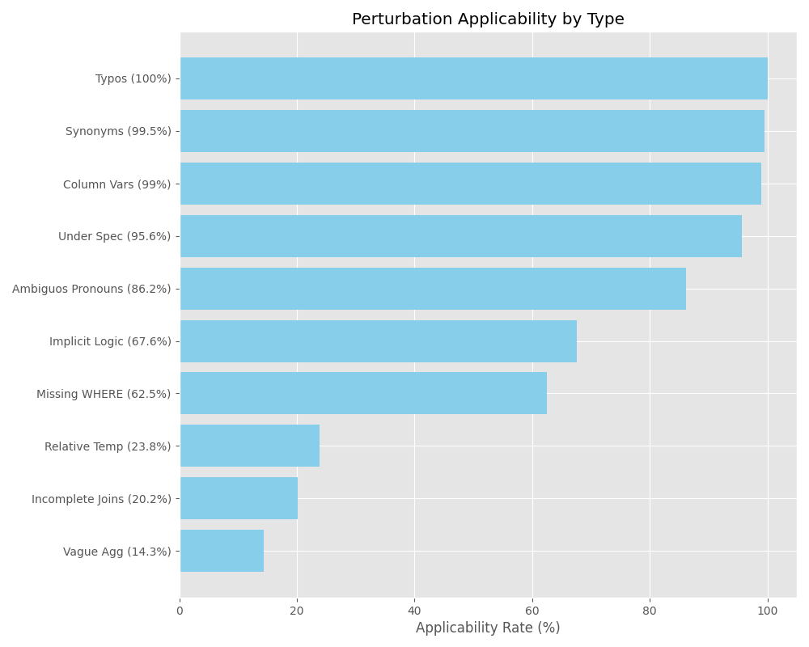
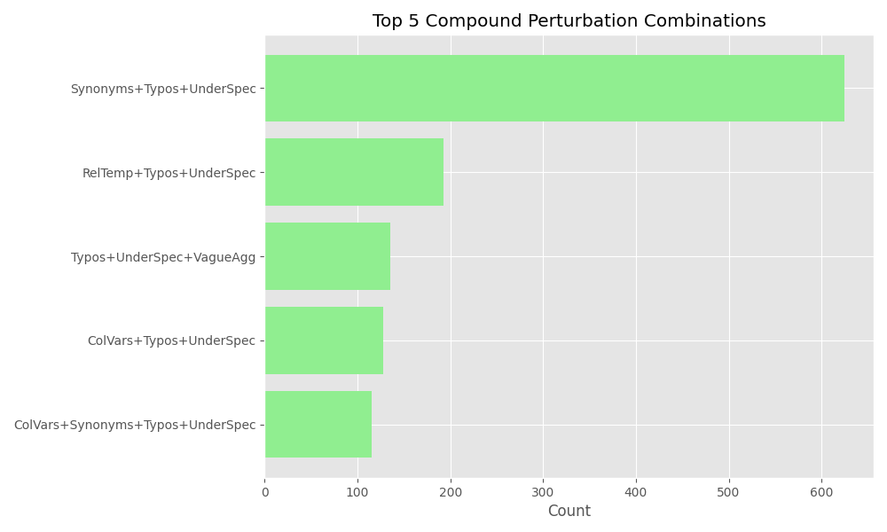

# Perturbation Analysis Report

## 1. Executive Summary

- **Total Attempted:** 2,100
- **Total Processed Queries:** 2,100
- **Failed Queries:** 0 (0.00% failure rate)

The project to generate realistic prompt perturbations using Gemini 2.5 Flash Lite is **100% complete**. All 2,100 SQL queries across 7 complexity categories have been successfully processed, with 10 single perturbations and 1 compound perturbation generated for each.

## 2. Applicability of Perturbations

The model evaluated 10 distinct perturbation types for each query. The rates below reflect how often each type was deemed "applicable" to a given natural language prompt.

| Perturbation Type | Applicable Count | Not Applicable | Rate (%) |
| :--- | :--- | :--- | :--- |
| **Typos** | 2,100 | 0 | 100.0% |
| **Synonym Substitution** | 2,089 | 11 | 99.5% |
| **Column Variations** | 2,078 | 22 | 99.0% |
| **Under Specification** | 2,008 | 92 | 95.6% |
| **Ambiguous Pronouns** | 1,811 | 289 | 86.2% |
| **Implicit Business Logic** | 1,420 | 680 | 67.6% |
| **Missing WHERE Details** | 1,312 | 788 | 62.5% |
| **Relative Temporal** | 500 | 1,600 | 23.8% |
| **Incomplete Joins** | 424 | 1,676 | 20.2% |
| **Vague Aggregation** | 300 | 1,800 | 14.3% |

### Key Observations
1.  **Universal Noise:** "Typos", "Synonyms", and "Column Variations" are universal perturbation vectors, applicable to virtually any query.
2.  **Structural Dependencies:** "Incomplete Joins" (20.2%) and "Vague Aggregation" (14.3%) strongly correlate with the specific `JOIN` and `AGGREGATE` complexity classes in the dataset.
3.  **High Ambiguity:** Over 95% of queries allowed for "Under Specification", confirming that real-world prompts often lack explicit schema details.

## 3. Complexity Distribution

The final dataset is perfectly balanced.

| Complexity | Count | Status |
| :--- | :--- | :--- |
| **Simple** | 300 | ✅ Complete |
| **Join** | 300 | ✅ Complete |
| **Aggregate** | 300 | ✅ Complete |
| **Advanced** | 300 | ✅ Complete |
| **Insert** | 300 | ✅ Complete |
| **Update** | 300 | ✅ Complete |
| **Delete** | 300 | ✅ Complete |

## 4. Compound Perturbations

The model created one "compound" version per query, applying 2 to 5 perturbations simultaneously.

*   **Average Perturbations per Compound:** 3.26

### Most Frequent Combinations

| Count | Combination |
| :--- | :--- |
| 625 | synonym_substitution, typos, under_specification |
| 193 | relative_temporal, typos, under_specification |
| 135 | typos, under_specification, vague_aggregation |
| 128 | column_variations, typos, under_specification |
| 115 | column_variations, synonym_substitution, typos, under_specification |

**Insight:** The dominant pattern (occurring in ~30% of cases) is **Synonyms + Typos + Under-specification**. This suggests the most "natural" form of messy input is a user who types quickly, uses loose terminology, and assumes the AI knows the schema.

## 5. Visualizations

### Processing Flow
**Total Queries: 2100** &rarr; **Processing Status** &rarr; **Success: 2100 (100%)** &rarr; **Data Ready for Training/Testing**

## 6. Dataset Examples by Complexity

Below are representative examples for each complexity type, showing the original prompt, SQL, and the generated perturbations.

### Simple
- **ID:** `1`
- **Original Prompt:** "Get c1.created_at from comments (as c1) where c1.user_id equals 180."
- **SQL:** `SELECT c1.created_at FROM comments AS c1 WHERE c1.user_id = 180`

**Single Perturbations (10):**
- ✅ **under_specification:** "Get created_at where the user ID equals 180."
- ✅ **implicit_business_logic:** "Get the comment creation time for that user."
- ✅ **synonym_substitution:** "Get c1.creation_date from entries (as c1) where c1.account_id equals 180."
- ❌ **incomplete_joins:** "None" _(Not Applicable: The prompt only mentions one table ('comments'), so there are no joins to make incomplete.)_
- ❌ **relative_temporal:** "None" _(Not Applicable: The prompt does not contain any explicit date or time conditions.)_
- ✅ **ambiguous_pronouns:** "Get its created_at from it where that ID equals 180."
- ❌ **vague_aggregation:** "None" _(Not Applicable: The prompt does not contain any aggregation functions (COUNT, SUM, AVG) or GROUP BY clauses.)_
- ✅ **column_variations:** "Get c1.creationDate from comments (as c1) where c1.userId equals 180."
- ✅ **missing_where_details:** "Get c1.created_at from comments (as c1) where c1.user_id is the relevant one."
- ✅ **typos:** "Get c1.created_at from commnets (as c1) where c1.user_id equls 180."

**Compound Perturbation:**
- "Get creation_date from entries where the account ID equals 18."
  - _Applied: under_specification, synonym_substitution, typos_

---

### Join
- **ID:** `301`
- **Original Prompt:** "Get c1.user_id, p1.content from posts (as p1) joined with comments (as c1) on p1.id equals c1.post_id."
- **SQL:** `SELECT c1.user_id, p1.content FROM posts AS p1 INNER JOIN comments AS c1 ON p1.id = c1.post_id`

**Single Perturbations (10):**
- ✅ **under_specification:** "Get user ID and content for posts and their comments."
- ❌ **implicit_business_logic:** "None" _(Not Applicable: The prompt does not contain specific filter conditions that can be replaced with business logic terms. It's a direct request for data retrieval based on a join.)_
- ✅ **synonym_substitution:** "Get member_id, article_content from articles (as p1) joined with reactions (as c1) on p1.article_id equals c1.article_id."
- ✅ **incomplete_joins:** "Get user_id and content from posts and comments."
- ❌ **relative_temporal:** "None" _(Not Applicable: The prompt does not contain any date or time-based conditions.)_
- ✅ **ambiguous_pronouns:** "Get it's user_id, that content from that table (as p1) joined with them (as c1) on p1.id equals c1.post_id."
- ❌ **vague_aggregation:** "None" _(Not Applicable: The prompt does not contain any aggregation functions or GROUP BY clauses.)_
- ✅ **column_variations:** "Get c1.userId, p1.content from posts (as p1) joined with comments (as c1) on p1.postId equals c1.postId."
- ❌ **missing_where_details:** "None" _(Not Applicable: The prompt does not contain a WHERE clause with specific filter details to make vague.)_
- ✅ **typos:** "Get c1.user_id, p1.content from posts (as p1) joined with commnets (as c1) on p1.id equals c1.post_id."

**Compound Perturbation:**
- "Get user ID and content for posts and comments, linking them by post."
  - _Applied: under_specification, incomplete_joins, typos_

---

### Aggregate
- **ID:** `601`
- **Original Prompt:** "Get c1.id, maximum of c1.id from comments (as c1) grouped by c1.id."
- **SQL:** `SELECT c1.id, MAX(c1.id) AS max_id FROM comments AS c1 GROUP BY c1.id`

**Single Perturbations (10):**
- ✅ **under_specification:** "Get id and maximum of id from comments grouped by id."
- ❌ **implicit_business_logic:** "None" _(Not Applicable: The prompt does not contain specific conditions or filters that can be replaced with vague business terms. It's a straightforward aggregation query.)_
- ✅ **synonym_substitution:** "Get c1.id, maximum of c1.id from messages (as c1) grouped by c1.id."
- ❌ **incomplete_joins:** "None" _(Not Applicable: The prompt only mentions one table ('comments'), so there are no joins to make incomplete.)_
- ❌ **relative_temporal:** "None" _(Not Applicable: The prompt does not contain any date or time conditions.)_
- ✅ **ambiguous_pronouns:** "Get it.id, maximum of it.id from comments (as it) grouped by it.id."
- ✅ **vague_aggregation:** "Show me the id and total of id from comments grouped by id."
- ✅ **column_variations:** "Get c1.commentId, maximum of c1.commentId from comments (as c1) grouped by c1.commentId."
- ❌ **missing_where_details:** "None" _(Not Applicable: The prompt does not contain any WHERE clause conditions.)_
- ✅ **typos:** "Get c1.id, maximum of c1.id from comments (as c1) gruped by c1.id."

**Compound Perturbation:**
- "Get id and total of id from comments gruped by id."
  - _Applied: under_specification, vague_aggregation, typos_

---

### Advanced
- **ID:** `901`
- **Original Prompt:** "Get all columns from subquery (as derived_table) that: Get all columns from follows (as inner_follows) where inner_follows.follower_id not equals 178."
- **SQL:** `SELECT * FROM (SELECT * FROM follows AS inner_follows WHERE inner_follows.follower_id <> 178) AS derived_table`

**Single Perturbations (10):**
- ✅ **under_specification:** "Get everything from a derived table based on follows where the follower ID is not 178."
- ✅ **implicit_business_logic:** "Get all follows excluding those from a specific user."
- ✅ **synonym_substitution:** "Get all columns from subquery (as derived_table) that: Get all columns from relationships (as inner_relationships) where inner_relationships.person_id not equals 178."
- ❌ **incomplete_joins:** "None" _(Not Applicable: The original prompt does not involve joins between multiple tables. It uses a subquery, which is a single table operation within a derived table context.)_
- ❌ **relative_temporal:** "None" _(Not Applicable: The original prompt does not contain any date or time conditions.)_
- ✅ **ambiguous_pronouns:** "Get all columns from it where that ID is not 178."
- ❌ **vague_aggregation:** "None" _(Not Applicable: The original prompt does not contain any aggregation functions (COUNT, SUM, AVG) or GROUP BY clauses.)_
- ✅ **column_variations:** "Get all columns from subquery (as derived_table) that: Get all columns from follows (as inner_follows) where inner_follows.fId not equals 178."
- ✅ **missing_where_details:** "Get all columns from subquery (as derived_table) that: Get all columns from follows (as inner_follows) where the follower is the correct one."
- ✅ **typos:** "Get all columns from subquery (as derived_table) that: Get all columns from follows (as inner_follows) where inner_follows.follower_id not equls 178."

**Compound Perturbation:**
- "Get everything from a derived table based on relationships where the person ID not equls 178."
  - _Applied: under_specification, synonym_substitution, typos_

---

### Insert
- **ID:** `1201`
- **Original Prompt:** "Insert into users the values (user92, user950@example.com, NOW(), TRUE, Sample text 10)."
- **SQL:** `INSERT INTO users (username, email, signup_date, is_verified, country_code) VALUES ('user92', 'user950@example.com', NOW(), TRUE, 'Sample text 10')`

**Single Perturbations (10):**
- ✅ **under_specification:** "Insert the values ('user92', 'user950@example.com', NOW(), TRUE, 'Sample text 10')."
- ❌ **implicit_business_logic:** "None" _(Not Applicable: The prompt is an INSERT statement, not a query with conditions that can be made implicit.)_
- ✅ **synonym_substitution:** "Add to accounts the values ('member92', 'member950@example.com', NOW(), TRUE, 'Sample text 10')."
- ❌ **incomplete_joins:** "None" _(Not Applicable: The prompt only involves a single table ('users') and no joins are implied or present.)_
- ❌ **relative_temporal:** "None" _(Not Applicable: The prompt does not contain any specific date/time conditions that can be converted to relative temporal references. 'NOW()' is a function, not a static date.)_
- ✅ **ambiguous_pronouns:** "Insert into it the values (that one, that email, NOW(), TRUE, Sample text 10)."
- ❌ **vague_aggregation:** "None" _(Not Applicable: The prompt is an INSERT statement and does not contain any aggregation functions or GROUP BY clauses.)_
- ✅ **column_variations:** "Insert into users the values (user92, user950@example.com, NOW(), TRUE, Sample text 10)."
- ❌ **missing_where_details:** "None" _(Not Applicable: The prompt is an INSERT statement and does not contain any WHERE clauses or filter conditions.)_
- ✅ **typos:** "Insert into usres the values (user92, user950@example.com, NOW(), TRUE, Sample text 10)."

**Compound Perturbation:**
- "Add to accouts the values ('member92', 'member950@example.com', NOW(), TRUE, 'Sample text 10')."
  - _Applied: under_specification, synonym_substitution, typos_

---

### Update
- **ID:** `1501`
- **Original Prompt:** "Update comments setting created_at to NOW() where comments.user_id greater than or equal to 626."
- **SQL:** `UPDATE comments SET created_at = NOW() WHERE comments.user_id >= 626`

**Single Perturbations (10):**
- ✅ **under_specification:** "Update comments setting created_at to NOW() where user_id greater than or equal to 626."
- ✅ **implicit_business_logic:** "Update recent comments to the current time for active users."
- ✅ **synonym_substitution:** "Update messages setting created_at to NOW() where messages.user_id greater than or equal to 626."
- ❌ **incomplete_joins:** "None" _(Not Applicable: The prompt only involves a single table ('comments'), so no joins are implied or necessary.)_
- ❌ **relative_temporal:** "None" _(Not Applicable: The prompt uses a specific function 'NOW()' to set the timestamp, not an absolute date or time value that can be converted to a relative expression.)_
- ✅ **ambiguous_pronouns:** "Update it setting created_at to NOW() where that user_id greater than or equal to 626."
- ❌ **vague_aggregation:** "None" _(Not Applicable: The prompt involves an UPDATE statement, not an aggregation function (like COUNT, SUM, AVG) or a GROUP BY clause.)_
- ✅ **column_variations:** "Update comments setting created_at to NOW() where comments.userId greater than or equal to 626."
- ✅ **missing_where_details:** "Update comments setting created_at to NOW() where the user is among the relevant ones."
- ✅ **typos:** "Update comments setting created_at to NOW() where comments.user_id greater than or equls 626."

**Compound Perturbation:**
- "Update messages setting created_at to NOW() where user_id is the relevant one for these posts."
  - _Applied: under_specification, synonym_substitution, missing_where_details, typos_

---

### Delete
- **ID:** `1801`
- **Original Prompt:** "Delete from users where users.signup_date less than date minus 17 DAY."
- **SQL:** `DELETE FROM users WHERE users.signup_date < DATE_SUB(NOW(), INTERVAL 17 DAY)`

**Single Perturbations (10):**
- ✅ **under_specification:** "Delete from users where the signup date is less than 17 days ago."
- ✅ **implicit_business_logic:** "Remove old user accounts."
- ✅ **synonym_substitution:** "Delete from members where members.account_creation_date less than date minus 17 DAY."
- ❌ **incomplete_joins:** "None" _(Not Applicable: The prompt does not involve joins between multiple tables.)_
- ✅ **relative_temporal:** "Delete from users where signup_date is older than last week."
- ❌ **ambiguous_pronouns:** "None" _(Not Applicable: The prompt does not contain references that can be made ambiguous with pronouns.)_
- ❌ **vague_aggregation:** "None" _(Not Applicable: The prompt does not involve aggregation functions or GROUP BY clauses.)_
- ✅ **column_variations:** "Delete from users where users.signUpDate less than date minus 17 DAY."
- ✅ **missing_where_details:** "Delete from users where the signup date is not recent."
- ✅ **typos:** "Delete from users where users.signup_date less than date minus 71 DAY."

**Compound Perturbation:**
- "Remove old user accounts that signed up a while ago."
  - _Applied: implicit_business_logic, relative_temporal, typos_

---
